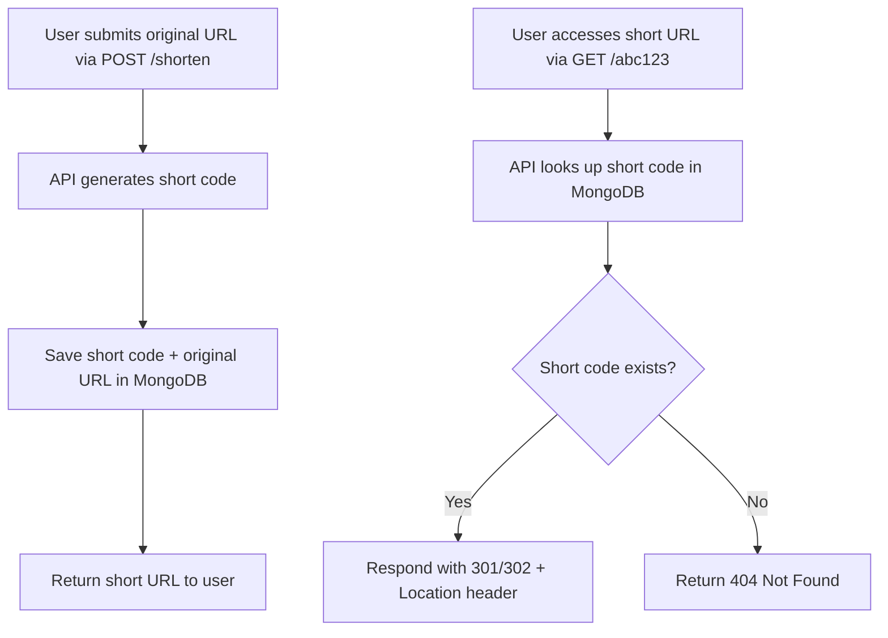

# **Tài liệu mô tả quá trình sử dụng AI để xây dựng hệ thống rút gọn link (URL Shortener)**

## **Bước 1: Lên ý tưởng và nghiên cứu kỹ thuật**

Tôi bắt đầu bằng việc hình thành ý tưởng xây dựng một API rút gọn liên kết giống như dịch vụ [Bit.ly](https://bit.ly).

Đây là ý tưởng của tôi:
```
My test is to build an API containing create url (shortlink) like bit.ly.
1. I want to use MongoDB to store URL
2. Let's create a .net 8 minimal API project
3. Let's create a table to store url shortlink, create index for searching effectively.
4. Let's create 2 APIs, one for creating shorturl (POST HTTP METHOD), one for redirecting user to the actual link that is in database (GET METHOD), make sure the input link exists on DB.
5. Explain the table definition for non-tech people using table
6. Explain the workflow of the project using diagram
```
Trong giai đoạn này, tôi nghiên cứu cách chuyển hướng người dùng bằng HTTP Response thông qua:

- **Status Code**: 301 hoặc 302
- **Header**: `Location` chứa URL đích

## **Bước 2: Sử dụng ChatGPT để hoàn thiện prompt**

Tôi sử dụng ChatGPT để xây dựng prompt yêu cầu chi tiết và rõ ràng. Dưới đây là prompt do AI hỗ trợ tạo ra:

```markdown
# URL Shortener API Project (like Bit.ly)

## Task
Build a URL shortener API similar to [Bit.ly](https://bit.ly).

## Requirements

1. Use **MongoDB** as the database to store original and shortened URLs.
2. Create a **.NET 8 Minimal API** project.
3. Define a MongoDB **collection** (similar to a SQL table) to store short URLs and create an **index** to optimize search queries.
4. Implement **two API endpoints**:
   - **POST** `/shorten`: Accepts a full URL and returns a shortened version.
   - **GET** `/{shortCode}`: Looks up the short code in the database, and if found:
     - Respond with HTTP **redirect** using:
       - **Status code** `302` (temporary) or `301` (permanent)
       - **Location** header pointing to the original URL
     - If not found, return `404 Not Found`.
5. Add a **simple explanation** using a table to describe the MongoDB document structure for non-technical users.
6. Provide a **workflow diagram** that illustrates how the system works from receiving a request to redirecting a user.

## Example MongoDB Document (Non-Technical Explanation)

| Field Name   | Description                           | Example                     |
|--------------|---------------------------------------|-----------------------------|
| `_id`        | Unique identifier for each record     | `60f7c2...`                 |
| `originalUrl`| The full URL input by the user        | `https://example.com/page` |
| `shortCode`  | The unique short path generated       | `abc123`                    |
| `createdAt`  | Timestamp of when it was created      | `2025-07-03T10:00:00Z`      |

## Workflow Diagram


```

## **Bước 3: Review kết quả**

Sau khi AI tạo prompt, tôi xem lại kỹ các nội dung:
- Cấu trúc API
- Cách lưu dữ liệu trong MongoDB
- Cơ chế chuyển hướng HTTP
- Biểu đồ mô tả luồng xử lý
- Cách giải thích cho người không chuyên

Kết quả phù hợp với mục tiêu ban đầu.

## **Bước 4: Bổ sung các prompt để hoàn thiện yêu cầu**

Tôi tiếp tục gửi các yêu cầu bổ sung để cải thiện kết quả và sát với kỳ vọng:

### Prompt 1: Đảm bảo phản hồi đúng quy định HTTP Redirect
```text
Let's return response following the given rule:

Respond with HTTP **redirect** using:
   - **Status code** `302` (temporary) or `301` (permanent)
   - **Location** header pointing to the original URL
If not found, return `404 Not Found`.
```

### Prompt 2: Tạo file solution để mở bằng Visual Studio
```text
Let's create a solution file to open in Visual Studio
```

---

## **Kết luận**

Quá trình sử dụng AI giúp tôi:
- Tăng tốc độ xây dựng tài liệu kỹ thuật
- Có cái nhìn rõ ràng hơn về kiến trúc và quy trình phát triển API
- Đảm bảo đầu ra có tính hoàn chỉnh và dễ hiểu cho cả người lập trình và không chuyên.
